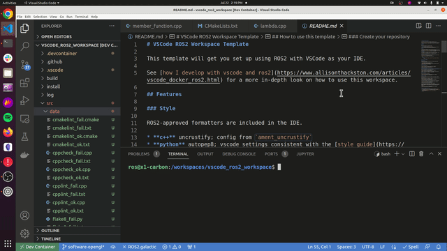

# ROS 2 Ament Task Provider

Provides [problem matchers](https://code.visualstudio.com/docs/editor/tasks#_processing-task-output-with-problem-matchers) and tasks for ROS 2 projects using the [ament build system](https://docs.ros.org/en/foxy/Concepts/About-Build-System.html?highlight=ament#id3).

## Installation

You can grab this from the [Visual Studio Code Marketplace](https://marketplace.visualstudio.com/items?itemName=althack.ament-task-provider) or simply search for "ament task provider" in the extensions tab of VS Code.

## Features

Provides the following problem matchers:

- **\$ament_cpplint** &mdash; adds errors and warnings reported by [ament_cpplint](https://github.com/ament/ament_lint/blob/master/ament_cpplint/doc/index.rst)
- **\$ament_cppcheck** &mdash; adds errors and warnings reported by [ament_cppcheck](https://github.com/ament/ament_lint/blob/master/ament_cmake_cppcheck/doc/index.rst)
- **\$ament_lint_cmake** &mdash; adds errors and warnings reported by [ament_lint_cmake](https://github.com/ament/ament_lint/blob/master/ament_cmake_lint_cmake/doc/index.rst)
- **\$ament_flake8** &mdash; adds errors and warnings reported by [ament_flake8](https://github.com/ament/ament_lint/blob/master/ament_flake8/doc/index.rst)
- **\$ament_mypy** &mdash; adds errors and warnings reported by [ament_mypy](https://github.com/ament/ament_lint/blob/master/ament_mypy/doc/index.rst)
- **\$ament_pep257** &mdash; adds errors and warnings reported by [ament_pep257](https://github.com/ament/ament_lint/blob/master/ament_cmake_pep257/doc/index.rst)
- **\$ament_uncrustify** &mdash; adds errors and warnings reported by [ament_uncrustify](https://github.com/ament/ament_lint/blob/master/ament_uncrustify/doc/index.rst)
- **\$ament_xmllint** &mdash; adds errors and warnings reported by [ament_xmllint](https://github.com/ament/ament_lint/blob/master/ament_xmllint/doc/index.rst)

Tasks are created dynamically for any `ament_*` tools found on your PATH. If a tool has a matching problem matcher, it is attached automatically; otherwise the task still runs but will not surface Problems.

## Usage



**Prerequisite** You must have the ament linters installed on your system for the appropriate linter to run.

```bash
sudo apt-get install ros-$ROS_DISTRO-ament-lint
```

From the task panel select `ament` and then the linter you'd like to run.

That's it!

### tasks.json

You can also save the configuration within your workspace like so:

.vscode/tasks.json

```jsonc
{
  "version": "2.0.0",
  "tasks": [
    {
      "type": "ament",
      "task": "cppcheck", // The ament tool name (without the ament_ prefix)
      "path": "src/", // The path to your source files
      "commandOptions": "", // Optional additional command line options
      "envSetup": "", // Optional setup to run before linter (ex: source /opt/ros/humble/setup.bash )
      "problemMatcher": [
        "$ament_cppcheck" // the corresponding problem matcher - can be used independently
      ],
      "label": "ament: cppcheck"
    }
  ]
}
```

### Settings

There is one optional setting that will set the setup script to run before the all of the linters in the workspace. This can be overwritten in the tasks.json file.


## Contributing

Want to contribute to this plugin! See [Contributing](CONTRIBUTING.md) for development details.

## License

This software is licensed under [Apache 2.0](https://github.com/athackst/htmlproofer-action/blob/main/LICENSE).

### Attributions

[Leaf icons created by Freepik - Flaticon](https://www.flaticon.com/free-icons/leaf)
